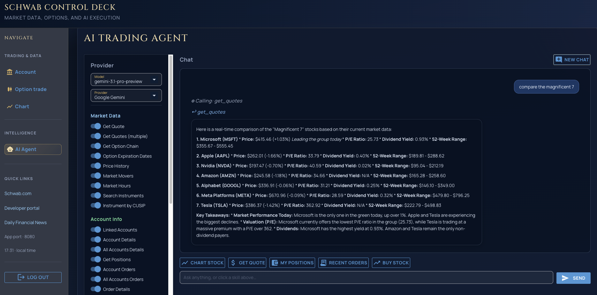

# Schwab API with UI & AI

Python app that uses [schwabdev](https://github.com/tylerebowers/Schwabdev) (Schwab API) with a **NiceGUI** web interface. Browse account data, option chains, price charts, and an AI agent that can call Schwab-related tools.

## Disclaimer

This project is provided **as-is** for **educational and personal experimentation only**. It is **not** financial, investment, legal, or tax advice. Trading and investing involve risk of loss; you are solely responsible for your decisions, your account activity, and for complying with Charles Schwab’s API terms of service, your brokerage agreements, and applicable laws and regulations.

The authors and contributors make **no warranty** regarding accuracy, availability, or fitness for a particular purpose and **disclaim liability** for any losses or damages arising from use of this software. Outputs from the AI agent may be incorrect, incomplete, or outdated—**verify everything** before acting, and do not rely on the agent alone to place or manage trades.

## Features

- **Account** — balances and positions
- **Option trade** — search and explore option chains
- **Chart** — price history visualization
- **AI Agent** — chat with tool use; supports Anthropic, OpenAI, or Gemini (configure one API key)

## Requirements

- Python 3.10+ (recommended)
- Schwab developer app credentials and completed OAuth/token flow (as required by `schwabdev`)

## Setup

```bash
python -m venv .venv
source .venv/bin/activate   # Windows: .venv\Scripts\activate
pip install -r requirements.txt
```

### Environment variables

Create `.env` in the project root (and optionally `src/.env` for keys you prefer to keep next to library code).

| Variable | Purpose |
|----------|---------|
| `APP_KEY` | Schwab app key |
| `APP_SECRET` | Schwab app secret |
| `APP_PASSWORD` | Password for the web UI login |
| `NICEGUI_STORAGE_SECRET` | Secret for signed user storage (set a long random value in production) |
| `NICEGUI_PORT` | Server port (default `8080`) |
| `GEMINI_API_KEY` | Optional; for Gemini in the agent |
| `OPENAI_API_KEY` | Optional; for OpenAI in the agent |
| `ANTHROPIC_API_KEY` | Optional; for Anthropic in the agent |

OAuth tokens are stored in **`.nicegui/schwab_tokens.db`** (relative to the process working directory), as configured in `src/client.py`. On first run, if that file is missing and **`.streamlit/schwab_tokens.db`** exists from an older setup, it is copied once so you do not have to re-authorize.

## Run

```bash
python app.py
```

Equivalent:

```bash
python nicegui_app.py
```

Open **http://localhost:8080** (or your `NICEGUI_PORT`), sign in with `APP_PASSWORD`, then use the drawer: Account, Option trade, Chart, AI Agent.

## Project layout (high level)

- `nicegui_app.py` — NiceGUI + FastAPI app, auth middleware, routes
- `app.py` — thin entry that runs `nicegui_app.py`
- `ui/` — NiceGUI pages (account, options, chart, agent)
- `src/` — Schwab client, orders, agent, logging, charts

## References

- NiceGUI: [https://nicegui.io/documentation](https://nicegui.io/documentation)
- Earlier Streamlit-oriented walkthrough (may not match current UI): [YouTube](https://youtu.be/J-8m5j3Zshs)
